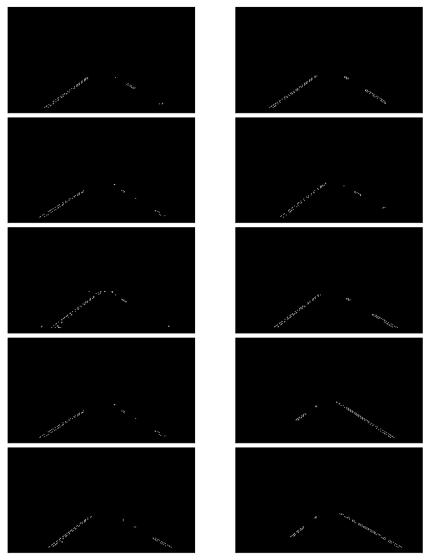

# **Finding Lane Lines on the Road** 
[](http://www.udacity.com/drive)

[](https://github.com/CZacker/self-driving-car-findline/blob/master/test_videos_output/solidWhiteRight.mp4)

***
In this project,there are some techniques below:  
1. Color Region  
2. Canny Edges(Gaussian smoothing、Edge Detection)
3. Hough Transform  

with this techniques,then to process video clips to find lane lines in them

***

## Some Test Images


lane lines are not always the same color, like these test images are in white or yellow. Further, the white lane lines are short or even just some series of dots. So that these lines need to be as one line.

---

## Color Region

first, selecting only yellow and write in the images using the RGB channels

use MATLAB image toolbox color-thresholder,find out color RGB channel region


```python
def select_rgb_white_yellow(image): 
    converted = convert_hls(image)
    # white color mask
    lower = np.uint8([  0, 200,   0])
    upper = np.uint8([255, 255, 255])
    white_mask = cv2.inRange(converted, lower, upper)
    # yellow color mask
    lower = np.uint8([ 10,   0, 100])
    upper = np.uint8([ 40, 255, 255])
    yellow_mask = cv2.inRange(converted, lower, upper)
    # combine the mask
    mask = cv2.bitwise_or(white_mask, yellow_mask)
    return cv2.bitwise_and(image, image, mask = mask)
```


---

It looks pretty good except some other color mix in, so we exclude outside the region of interest by apply a mask.

```python
def region_of_interest(img, vertices):
    #defining a blank mask to start with
    mask = np.zeros_like(img)   
    #defining a 3 channel or 1 channel color to fill the mask with depending on the input image
    if len(img.shape) > 2:
        channel_count = img.shape[2]  # i.e. 3 or 4 depending on your image
        ignore_mask_color = (255,) * channel_count
    else:
        ignore_mask_color = 255       
    #filling pixels inside the polygon defined by "vertices" with the fill color    
    cv2.fillPoly(mask, vertices, ignore_mask_color)   
    #returning the image only where mask pixels are nonzero
    masked_image = cv2.bitwise_and(img, mask)
    return masked_image
rows, cols = img.shape[:2]
bottom_left  = [cols*0.1, rows*0.95]
top_left     = [cols*0.4, rows*0.6]
bottom_right = [cols*0.9, rows*0.95]
top_right    = [cols*0.6, rows*0.6] 
vertices = np.array([[bottom_left, top_left, top_right, bottom_right]], dtype=np.int32)
cut_img=region_of_interest(img_gray,vertices)

```


---
using computer vision，let‘s go ahead and convert to grayscale

```python
def grayscale(img):
    """Applies the Grayscale transform
    This will return an image with only one color channel
    but NOTE: to see the returned image as grayscale
    (assuming your grayscaled image is called 'gray')
    you should call plt.imshow(gray, cmap='gray')"""
    return cv2.cvtColor(img, cv2.COLOR_RGB2GRAY)
    # Or use BGR2GRAY if you read an image with cv2.imread()
    # return cv2.cvtColor(img, cv2.COLOR_BGR2GRAY)
```


---

## Canny Edges

use Canny and fiddle with the parameters for the Gaussian smoothing and Edge Detection to optimize for detecting the lane lines well

### Gaussian smoothing

```python
def gaussian_blur(img, kernel_size):
    """Applies a Gaussian Noise kernel"""
    return cv2.GaussianBlur(img, (kernel_size, kernel_size), 0)
```
***The GaussianBlur takes a kernel_size parameter which we will need to play with to find one that works best. tried 3, 5, 9, ..., 17 (they must be positive and odd) and check the edge detection (see the next section) result. The bigger the kernel_size value is, the more blurry the image becomes.

The bigger kearnel_size value requires more time to process. It is not noticeable with the test images but we should keep that in mind (later we'll be processing video clips). So, we should prefer smaller values if the effect is similar.***

### Edge Detection

```python
def canny(img, low_threshold, high_threshold):
    """Applies the Canny transform"""
    return cv2.Canny(img, low_threshold, high_threshold)
img_canny=canny(img,50,150) 
```
[cv2.Canny](https://docs.opencv.org/3.1.0/da/d22/tutorial_py_canny.html)  
The function finds edges in the input image image and marks them in the output map edges using the Canny algorithm. The smallest value between threshold1 and threshold2 is used for edge linking. The largest value is used to find initial segments of strong edges. See http://en.wikipedia.org/wiki/Canny_edge_detector



---

## Hough Transform

[cv2.HoughLinesP()](https://opencv-python-tutroals.readthedocs.io/en/latest/py_tutorials/py_imgproc/py_houghlines/py_houghlines.html)  
OpenCV implementation is based on Robust Detection of Lines Using the Progressive Probabilistic Hough Transform by Matas, J. and Galambos, C. and Kittler, J.V.. The function used is cv2.HoughLinesP(). It has two new arguments.
1. minLineLength - Minimum length of line. Line segments shorter than this are rejected.
2. maxLineGap - Maximum allowed gap between line segments to treat them as single line.

Best thing is that, it directly returns the two endpoints of lines. In previous case, you got only the parameters of lines, and you had to find all the points.

```python
def hough_lines(img, rho, theta, threshold, min_line_len, max_line_gap):
    lines = cv2.HoughLinesP(img, rho, theta, threshold, np.array([]), minLineLength=min_line_len, maxLineGap=max_line_gap)
    line_img = np.zeros((img.shape[0], img.shape[1], 3), dtype=np.uint8)
    draw_lines(line_img, lines)
    # line_img = draw_lane_lines(line_img,lane_lines(line_img, lines))
    return line_img
```

---
## Extrapolating Lines
There are multiple lines detected for a lane line. We should come up with an averaged line for that.  

Also, some lane lines are only partially recognized. We should extrapolate the line to cover full lane line length.  

We want two lane lines: one for the left and the other for the right. The left lane should have a positive slope, and the right lane should have a negative slope. Therefore, we'll collect positive slope lines and negative slope lines separately and take averages.  

```python
def average(lines):
    '''
    separating line segments by their 
    slope ((y2-y1)/(x2-x1)) to decide which segments are part of the left
    line vs. the right line.
    '''
    left_lines = [] # [slope, intercept]
    left_length = [] # [length]
    right_lines = [] # [slope, intercept]
    right_length = [] # [length]   
    # Empty array for slope,intercept and length    
    for line in lines:
        for x1, y1, x2, y2 in line:
            if x2==x1:
                continue # ignore a vertical line => slope=0
            slope = (y2-y1)/(x2-x1)
            intercept = y1 - slope*x1
            length = np.sqrt((y2-y1)**2+(x2-x1)**2)           
            if slope < 0: # y is reversed in image
                left_lines.append((slope, intercept))
                left_length.append((length))
            else:
                right_lines.append((slope, intercept))
                right_length.append((length))    
    # add more weight to longer lines    
    # dot => Dot product of two arrays. 
    left_lane_line  = np.dot(left_length,  left_lines) /np.sum(left_length)  if len(left_length) >0 else None
    right_lane_line = np.dot(right_length, right_lines)/np.sum(right_length) if len(right_length)>0 else None
    return left_lane_line, right_lane_line # (slope, intercept)

def draw_line_points(y1, y2, line):
    """
    Convert a line represented in slope and intercept into pixel line
    """
    if line is None:
        return None    
    slope, intercept = line   
    # make sure everything is integer as cv2.line requires it
    x1 = int(int(y1 - intercept)/slope)
    x2 = int(int(y2 - intercept)/slope)
    y1 = int(y1)
    y2 = int(y2)
    return ((x1, y1), (x2, y2))

def lane_lines(image, lines):
    left_lane, right_lane = average(lines)   
    y1 = image.shape[0] # bottom of the image
    y2 = y1*0.6         # slightly lower than the middle
    left_line  = draw_line_points(y1, y2, left_lane)
    right_line = draw_line_points(y1, y2, right_lane)   
    return left_line, right_line

def draw_lines(img, lines, color=[255, 0, 0], thickness=2):
    """
    NOTE: this is the function you might want to use as a starting point once you want to 
    average/extrapolate the line segments you detect to map out the full
    extent of the lane (going from the result shown in raw-lines-example.mp4
    to that shown in P1_example.mp4).  
    Think about things like separating line segments by their 
    slope ((y2-y1)/(x2-x1)) to decide which segments are part of the left
    line vs. the right line.  Then, you can average the position of each of 
    the lines and extrapolate to the top and bottom of the lane. 
    This function draws `lines` with `color` and `thickness`.    
    Lines are drawn on the image inplace (mutates the image).
    If you want to make the lines semi-transparent, think about combining
    this function with the weighted_img() function below
    """
    for line in lines:
        for x1,y1,x2,y2 in line:
            cv2.line(img, (x1, y1), (x2, y2), color, thickness)

def draw_lane_lines(image, lines, color=[255, 0, 0], thickness=10):
    '''
    make a separate image to draw lines and combine with the orignal later    
    This function draws `lines` with `color` and `thickness`.    
    Lines are drawn on the image inplace (mutates the image).
    If you want to make the lines semi-transparent, think about combining
    this function with the weighted_img() function below
    '''    
    line_image = np.zeros_like(image)
    for line in lines:
        if line is not None:
            cv2.line(line_image, *line,  color, thickness)            
    return line_image
```


## Test on Videos

`solidWhiteRight.mp4`

`solidYellowLeft.mp4`

**Note: if you get an import error when you run the next cell, try changing your kernel (select the Kernel menu above --> Change Kernel). Still have problems? Try relaunching Jupyter Notebook from the terminal prompt. Also, consult the forums for more troubleshooting tips.**

**If you get an error that looks like this:**
```
NeedDownloadError: Need ffmpeg exe. 
You can download it by calling: 
imageio.plugins.ffmpeg.download()
```
**Follow the instructions in the error message and check out [this forum post](https://discussions.udacity.com/t/project-error-of-test-on-videos/274082) for more troubleshooting tips across operating systems.**


